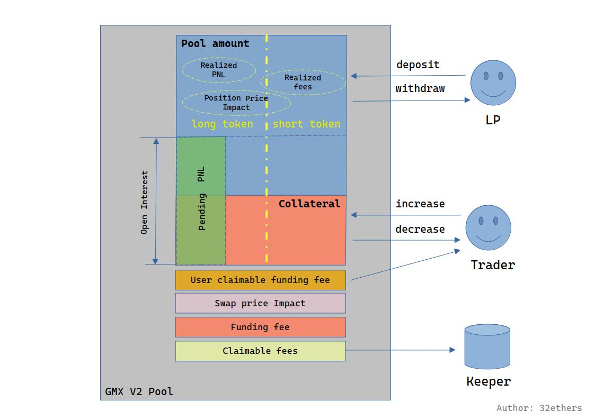

# 深入GMX V2 - 介绍

## 前言

GMX 是一个去中心化交易所（DEX），专注于现货和永续合约交易，以其低费用、零滑点交易和高杠杆功能在去中心化金融（DeFi）领域占据重要地位。由于团队保持匿名，且文档较为潦草。市面很难找到详细介绍GMX V2的资源。这极大的影响了GMX相关量化策略的研究。对此，我们不得不花了一些时间对GMX V2设计以及实现进行整理，并撰写了这个系列文章。

本文面向的对象是DEFI的研究者，仅限技术讨论，不涉及任何投资建议。

由于本文内容大多通过代码整理，难免有疏漏和错误，欢迎各位读者讨论并指正。

## GMX V2介绍

GMX 最初于 2021 年 9 月以 Gambit Exchange 的名称在 BNB Chain 上推出，随后更名为 GMX，并全面迁移至以太坊 Layer-2 解决方案 Arbitrum，并在 2022 年初扩展至 Avalanche 区块链。GMX 的核心目标是提供一个高效、透明且用户友好的去中心化交易平台，通过非托管的钱包交易机制，使用户能够完全掌控自己的资产。2025 年 3 月，GMX 进一步扩展至 Solana 区块链（以 GMX-Solana 的形式）。截至 2025 年，GMX 已成为 Arbitrum 和 Avalanche 生态系统中领先的衍生品交易平台，累计交易量超过 2770 亿美元，用户总数超过 72.8 万。

目前GMX仍然在迭代中，后续的计划见[这里](https://gov.gmx.io/t/gmx-v2-2-v2-3/4223)。

GMX项目有4种代币：

* GMX：GMX项目的治理代币
* GLP：GMX V1版本的LP持仓凭证
* GM：GMX V2版本的LP持仓凭证
* GLV：GMX V2的进阶版本。在V2上构建了一个Vault概念。投资Vault后，可以在相同抵押品的所有池中，挑选自动挑选最优的pool投资。目前GLV有两种BTC-USDC和ETH-USDC。

### GMX V2 pool

GMX V2的一大改进是将各个代币的交易池独立，这隔绝了各个代币之间的影响。交对于一个池来说，有三种代币:

1. Long token：做多代币，比如BTC，ETH
2. Short token：做空代币。基本都是USDC
3. Index token：指数代币，说白了就是永续合约要追踪的标的。

比如对于ETH/USD[ETH-USDC]池，long和index token都是ETH，short token是USDC。随着ETH价格变动，trader会有不同的PNL。

还有一种池是合成资产池。对与波动比较大的代币，GMX允许抵押相对稳定的币种。如AAVE/USD[ETH-USDC]这个池，Long token是ETH，short token是USDC，index token是AAVE。这个池用ETH代替AAVE来支持多头交易，减少抵押品本身的波动，降低资金的风险。

还有一种类型是单一币种池，long和short都是一个币种，如ETH/USD[WETH-WETH]，long和short token都是WETH。 使用单一资产可以让LP以币本位做市，减少价格波动带来的损失.

另外，每个Pool都继承了ERC20合约，也就是说每个Pool就是一个token，这个Token被称作Market token，也被成为GM。LP在提供流动性后，会获得一些Market token，这些ERC20 Token也可以再次流通。而trader在开仓后，GMX不会发给trader任何凭证，只在合约中记录了仓位的信息。

### 价格

对于永续合约来说，价格是非常核心的问题，小的CEX肆意扎针让人心有余悸。而GMX价格来源使用 [Chainlink Data Stream](https://docs.chain.link/data-streams)，减少价格操纵风险。这样做有两个优势：

* 低延迟：价格更新频率更高（接近实时），相比GMX V1 的传统预言机，减少了价格滞后和滑点，确保交易价格更贴近市场真实价格。

* 防操纵：通过多源价格聚合和 Chainlink 的去中心化验证，V2 降低了单一数据源被攻击或操纵的可能性，保障价格数据的稳定性。

### GMX V2的运行机制

GMX的核心功能是永续合约交易，通俗来说，允许trader抵押一定本金，并借用一部分资金做杠杆交易，交易可以做多，也可以做空。

鉴于链上资源的限制，GMX没有采用订单簿模型，trader借用的资金，由流动性提供者(LP)来提供。在这里，LP的角色相当于CEX的做市商，与trader形成对手方。Trader的利润，就是LP的损失，反之亦然。举例来说，如果市场上多头（long）的pnl是1000u，空头（short）的pnl是-400u，那么中间这600u的空缺就要由池中所有的LP共同承担。

为此，LP承担了被动交易的风险，成为容易受损失的一方(PS：很多地方都在说成为做市商都是稳赚不赔。但实际上这种说法并不科学)。为了补偿LP，所有交易手续费，连同借款手续费，都按照一定比例分配给了LP。
同时，LP的资金也被用在为SWAP提供流动性。这与其他DEX是相似的。由于SWAP只是GMX的副业，因此GMX的swap费率极低(0.07%)，相比其他DEX占很大优势。

为了平衡多空，GMX设置了funding fee机制，这也是永续合约的核心机制。funding fee在多头和空头之间转移，用于平衡多空双方。如果多头占优势，多头就要付给空头funding fee，反之空头就要给多头付funding fee。

为了平衡池中long和short代币的数量，GMX还设置了Price Impact机制。如果一笔交易，让池中的两种token变得更平衡(价值比例为1:1)，那么就会得到一点奖励。如果让池中的token变得不平衡，就要付出额外的费用。比如，如果pool中BTC:USDC的比例是100:98，此时BTC多，USDC少。如果此时进行从USDC到BTC的SWAP操作，会让USDC增多，BTC减少，那么GMX就会在输出金额中增加一些额外的奖励。price impact有两种，分别是position price impact和swap price impact。

## 单词表

GMX的源码中有很多术语，读懂这些术语对看懂GMX的源代码很有帮助，这里整理了一些常见的术语，并介绍他们在代码中的含义.

永续部分：

* trader：进行永续交易的用户. 通过index price的变动获取收益. 
* long：做多
* short：做空
* open interest：trader的头寸，通常这个概念偏向于金额
* position：trader在做永续合约交易后，所开的头寸。这个概念偏重于用户投资了这个东西，得到了这个衍生品。
* increase position/decrease position：trader开杠杆或者平仓的行为.
* Order：特指increase position/decrease position/swap操作的订单，与LP无关
* collateral：进行合约交易时，trader抵押的资产。
* funding fee：平衡多空双方的费用.
* position price impact：平衡pool中两种代币的费用。
* borrowing fee：trader在加杠杆后，collateral以外的资金属于向LP的借款，因此要对这部分资金支付借款手续费。
* PNL：trader做永续合约交易的收入或者损失。

LP部分:

* LP：为池提供流动性的用户。通过获取手续费，以及做trader的对手方获取收益。
* deposit：LP提供流动性行为
* withdraw：LP撤出流动性的行为
* pool amount：池中所有LP质押的资金的总量。
* pool value：池中所有LP所能获取的价值。这个价值包括LP抵押的token，手续费收入，pnl，和position price impact。
* market token amount：LP所持有凭证的数量。表示提供了多少流动性。这个token就是Pool本身。
* swap price impact：平衡pool中两种代币的费用。

其他：

* keeper：执行交易的服务器。
* claimable fee：手续费收入有一部分(通常是37%)被划为claimable fee，这部分费用会由keeper定期收走。
* capped：受限制的，有时候金额会受到一些限制，比如cappedPNL，也就是trader能够获得的PNL不能超过这个限制。
* Virtual Market：在GMX V2中有虚拟市场的概念，这个概念和price impact相关，多个pool会共享一个virtual market id，形成一个虚拟市场。计算price impact的时候会比较pool和虚拟市场的平衡性，按照小的值像用户收取price impact，减少用户price impact的支出。

## 资金模型

在解析GMX V2的时候，最让人困惑的部分就是GMX pool中，资金分为多少部分，每个部分是什么关系。只有理解了这一点，才能真正了解GMX池的运作方式。我根据GMX的代码整理了一个GMX的资金模型。图中灰色部分代表整个交易池，实线代表每部分的资金，虚线是该资金来源的说明。

### Pool amount

蓝色的部分是pool amount，这个名字非常容易混淆，让人以为这是池中所有Long/Short token的数量。到区块链浏览器看一下就会发现，Pool的余额和Pool amount是对不上的。实际上Pool amount仅仅是LP对应资产，仅占池子代币余额的一部分。

LP通过deposit向池内注入资金。原则上，注入的资金中，long和short的比例应该是1:1，也就是应该尽量维持long和short token平衡。如果比例不均衡甚至只抵押一个币种也可以。如果只存入long，会有一半被兑换为short，同时收取(或者发放)对应的swap price impact。

除了用户的deposit，pool amount中另一个非常重要的部分是Realized PNL。前面说过trader互为对手方，如果trader盈利，就要从Pool amount中拿走一部分钱作为利润。如果trader亏损，就会把trader的一部分collateral扣掉，并充值到Pool amount中。不过，这个"转帐"并不是时时刻刻进行的。比如trader Alice以200u的本金投资了多头，当 index price上涨，Alice得到了100u的盈利，此时这100u仅仅属于账面上的盈利，还没有落到Alice的口袋中，因此它于Pending PNL。而且此时LP那边，Pool amount的数量也不会变化。只有在Alice关闭头寸的时候，这100u连同200u的本金一起转入Alice的钱包。而这100u对LP形成了-100u的亏损，pool amount会扣掉100u。此时pending PNL变成了realized PNL。

需要注意，尽管pending pnl对Pool amount不会造成影响，但是对pool value还是有影响的。Pool value代表了LP的所有资产，Pending值也包括在内。

|                         | Alice‘s position | Pool amount | Pool value |
| ----------------------- | ---------------- | ----------- | ---------- |
| 投入200u                | 0 + 200 = 200    | 不变        | 不变       |
| 价格上涨，Alice盈利100u | 200 +100 = 300   | 不变        | -100       |
| Alice止盈，关闭头寸     | 300 - 300 = 0    | -100        | -100       |

LP还有一块稳定的收入就是手续费，包括

* Position fee：永续交易的手续费
* swap fee：swap交易和LP交易的手续费
* borrowing fee：永续头寸的资金占用费.

另一个比较小的部分是Realized position price impact。这部分是trader的order产生的。用于平衡pool中long/short token的数量.

### Collateral

橙色的部分是Collateral，存放的是Order的抵押资金。 这部分其实是一个虚拟的部分。Pool中只用了一个Collateral Sum记录了总的抵押量。具体每个用户有多少抵押，被记录在了每个Position对象中。

用户对头寸的操作是通过Increaes或者decrease。抵押的金额乘以杠杆，就是Open interest，比如用户抵押了5，开了10倍杠杆，Open interest就是50。合约会记录总Open Interest，这个数据很重要，计算PNL和borrowing fee都会用到。trader开仓有四种情况:

* 做多(long)：
  * 抵押long token
  * 抵押short token
* 做空(short):
  * 抵押long token
  * 抵押short token

合约会单独记录每种情况的总Open interest。

Open interest中多出来那部分钱(按照上面的例子就是50-5=45)，可以看作trader是从LP那里借的，所以要支付borrowing fee。

而随着Index price的变化，用户的Open Interest会变多或者变少，这部分变化就是PNL。在用户关闭头寸之前，它是随时变化的，没有写入LP的资金池(pool amount)中，所以它处于pending的状态。

### 其它

Pool还有几个独立于Collateral和Pool amount的部分。最重要的是funding fee，这部分用于平衡多空双方。占优势放需要支付funding fee，另一方则会收到funding fee。用户funding fee会根据fundingFeeAmountPerSize积累，如果如果需要支付，会统一在decrease的时候扣除。如果有盈余，则会被转入user claimable funding fee，用户需要单独发起交易领取。

swap price impact是swap交易(包括LP的deposit和withdraw)相关的Price impact。

claimable fee与Pool amount中的realized fee同源。所有的手续费，会有63%分给LP(也就是转入Pool amount成为realized fee)，剩下的37%，则会转入到claimable fee中。keeper会定期到各个pool中收取这些手续费。注意分配的比例是可配置的，不同的池可能不同。

## 总结

这篇文章介绍了GMX的运作方式，基本概念，以及资金存放的方式。后面将结合合约源码，介绍GMX如何进行交易。
