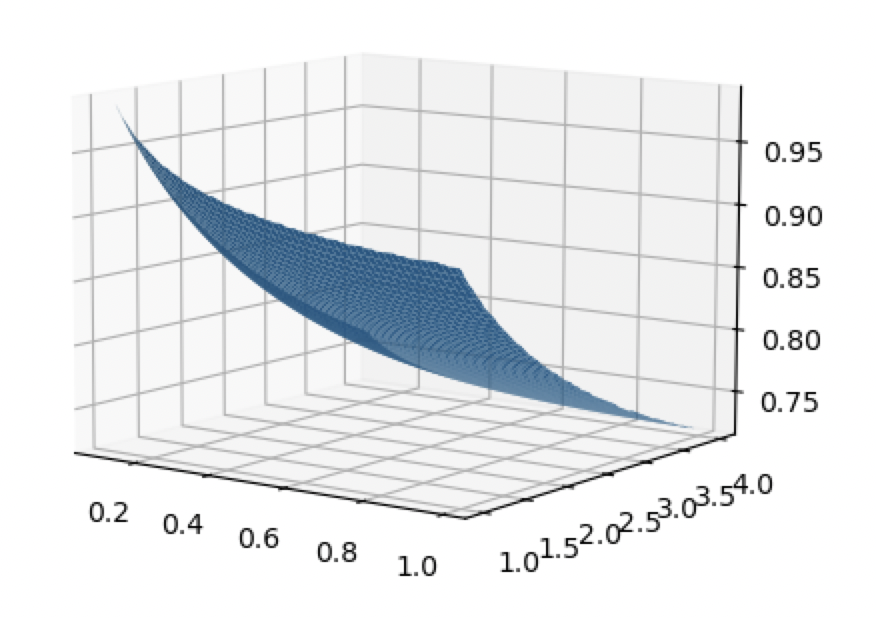

# 6 隐含波动率
在之前的https://medium.com/zelos-research/an-lvr-approach-proof-of-guillaume-lambert-s-uniswap-v3-implied-volatility-6671883e46e2 中我们讨论了LVR 和 Lambert 能推导出相同的iv 公式。

在本篇中，我们会给出我们的隐含波动率计算方法，和一些有趣的结论，详细代码参考在https://github.com/zelos-alpha/uniswap-iv

## 隐含波动率的计算
本质上来说，当我们得到期权定价公式时这个问题已经解决了。
$pv = f(\sigma,r,C,L,H)$

其中$L,H$ 为做市范围，r 无风险利率和C 单位流动性手续费收益，通过简单的二分查找，找到对应的sigma即可求解。
```python
def get_one_position_iv(r,mu,C,H,L,max_iterations=100,tolerance=1e-5):
    #use bisection method to find the iv,make the pv is 1
    lower,upper = 0.01,10
    for i in range(max_iterations):
        iv = (lower+upper)/2
        pv = uni_v3_pricing_euroexcu_gbm_version_analytic_general_solution(1,H,L,r,mu,C,iv)
        if pv<1:
            upper = iv
        else:
            lower = iv
        if abs(pv-1)<tolerance:
            return iv

    raise ValueError("No solution found,failed for H,L:",H,L)
```

以    r = 0.05，mu = 0.00 C = 0.2 作为参数遍历L，H，我们可以得到对应的隐含波动率为


LVR或者说lambert 的iv 认为不同做市范围 对应的iv 都是一样的。但实际上并不是。

## 一日iv
我们的公式里包含了$H,L$,这意味着不同做市范围有不同的波动率观点，那我们分别对其求解隐含波动率，则会得到一个波动率观点的分布，加权是其流动性的美元价值。 
例如在matic2024年12月8日这一天，我们得到了流动性提供者对市场波动率的观点为：

这表明流动性提供者对市场波动率有不同的看法，这可以归因于他们不同的风险偏好和市场预期。

## iv 时间序列
我们只需要求出加权平均值，就获得了这一天的隐含波动率，由于我们能计算出分布，我们还可以继续画出其1% 和 99% 百分位。
结果如下：


## 还可以做什么
流动性提供者可以有和其他人不同的波动率观点，那么相比于所有LP 的加权那么是否存在一个更好的iv 统计方法呢。我们只统计有更好投资表现的流动性提供者的波动率观点。smart iv。
但本系列还有些更优先的问题需要讨论。下一章，我们会讨论
1. pv 越大越好嘛
2. 如何选取最佳做市范围
