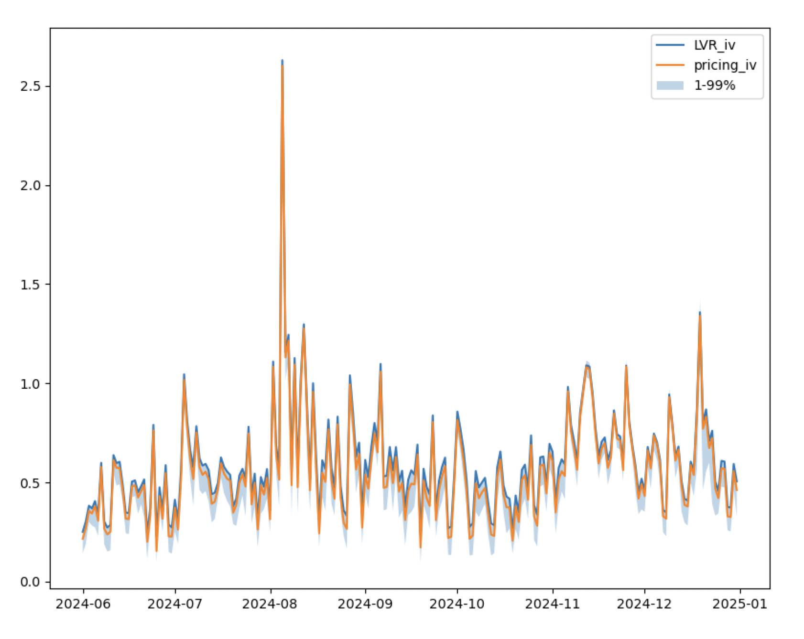

# 6 Implied Volatility
In the previous article [here](https://medium.com/zelos-research/an-lvr-approach-proof-of-guillaume-lambert-s-uniswap-v3-implied-volatility-6671883e46e2), we discussed how LVR and Lambert can derive the same IV formula.

In this article, we will present our method for calculating implied volatility and some interesting conclusions. Detailed code can be found [here](https://github.com/zelos-alpha/uniswap-iv).


## Calculation of Implied Volatility
Essentially, once we have the option pricing formula, the problem is solved. We just need to align the real option price with different sigma values. For Uniswap V3, in Part 5, we obtained:
$pv = f(\sigma, r, C, L, H)$

Where $L, H$ are the liquidity provision ranges, $r$ is the risk-free rate, and $C$ is the unit liquidity fee return. By using a simple bisection method, we can find the corresponding sigma to solve the equation.
```python
def get_one_position_iv(r, mu, C, H, L, max_iterations=100, tolerance=1e-5):
    # Use bisection method to find the IV, making the PV equal to 1
    lower, upper = 0.01, 10
    for i in range(max_iterations):
        iv = (lower + upper) / 2
        pv = uni_v3_pricing_euroexcu_gbm_version_analytic_general_solution(1, H, L, r, mu, C, iv)
        if pv < 1:
            upper = iv
        else:
            lower = iv
        if abs(pv - 1) < tolerance:
            return iv

    raise ValueError("No solution found, failed for H, L:", H, L)
```

Using parameters $r = 0.05$, $\mu = 0.00$, and $C = 0.2$ to traverse $L$ and $H$, we can obtain the corresponding implied volatility as shown below:


LVR or Lambert's IV assumes that the IV corresponding to different liquidity ranges is the same. Our model can fix that.

## one day iv
我们的公式里包含了$H,L$,这意味着不同做市范围有不同的波动率观点，那我们分别对其求解隐含波动率，则会得到一个波动率观点的分布，加权是其流动性的美元价值。 
例如在matic2024年12月8日这一天，我们得到了流动性提供者对市场波动率的观点为：


## iv 时间序列
我们只需要求出加权平均值，就获得了这一天的隐含波动率，由于我们能计算出分布，我们还可以继续画出其1% 和 99% 百分位。
结果如下：




## 还可以做什么
流动性提供者可以有和其他人不同的波动率观点，那么相比于所有LP 的加权那么是否存在一个更好的iv 统计方法呢。我们只统计有更好投资表现的流动性提供者的波动率观点。smart iv。
但本系列还有些更优先的问题需要讨论。下一章，我们会讨论
1. pv 越大越好嘛
2. 如何选取最佳做市范围
